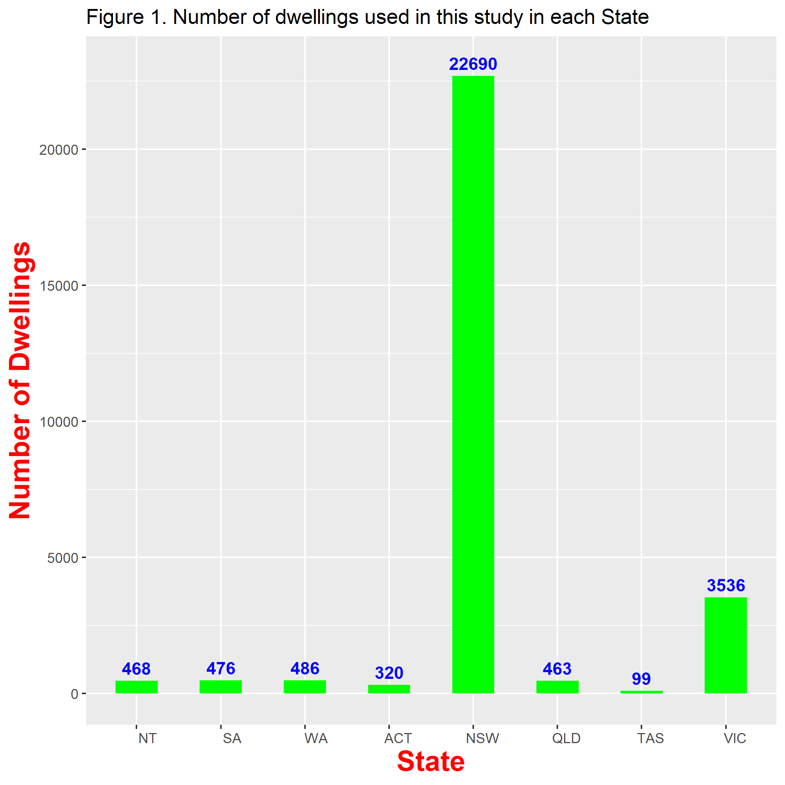
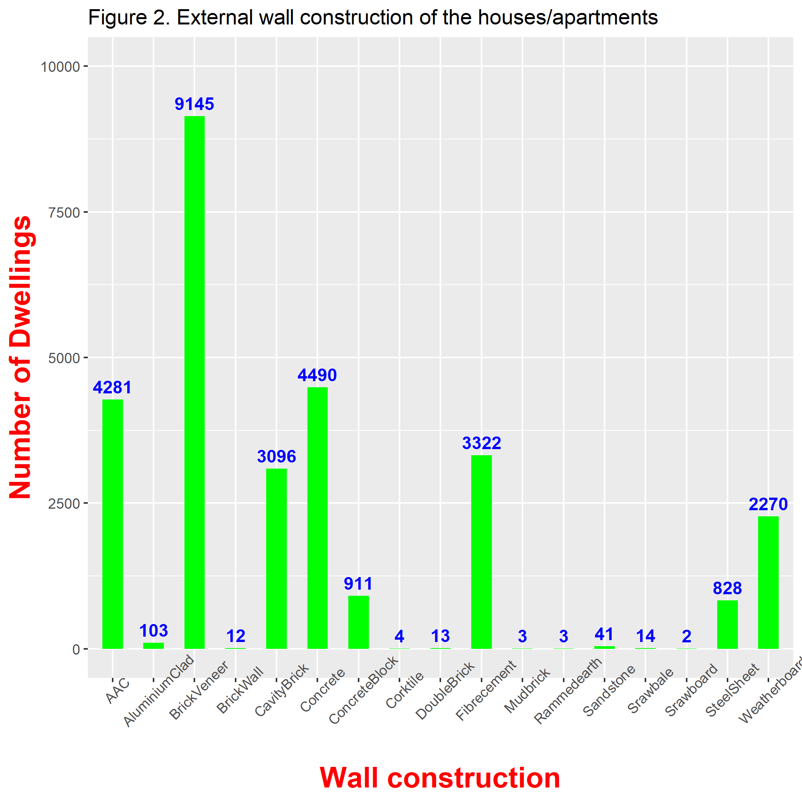
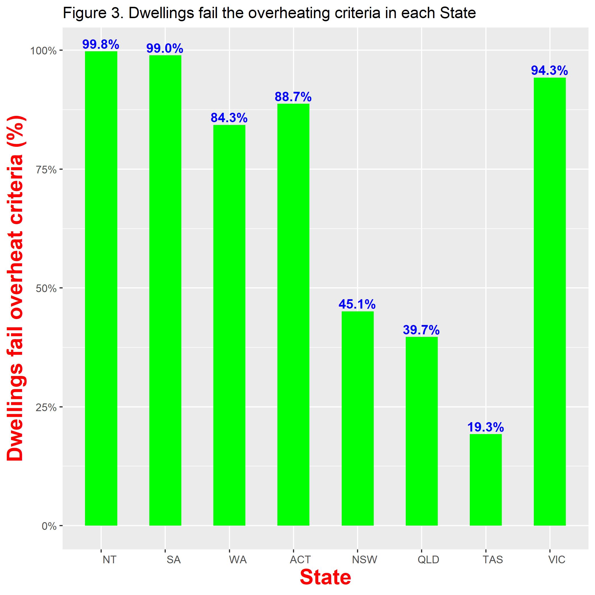
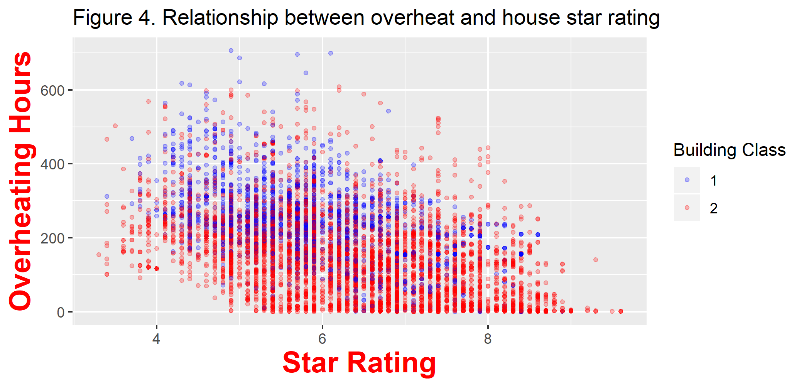

```{r setup, include=FALSE}
knitr::opts_chunk$set(
  results = 'asis',
  echo = FALSE,
  warning = FALSE,
  message = FALSE,
  fig.align = 'center'
)

#Load libraries
library(tidyverse)
library(gapminder)
library(kableExtra)
```


# Introduction
I am a researcher with years of programming experiences in FORTRAN, a computational programming language. Programming, computate simulations, research and communicating with various stakeholders and research partners in residential building energy efficiency are my daily activities. 

# My Project
Heat wave has been recognized as one of the major natural hazards which kill more people than any other natural hazards in Australia. Overheating in residential buildings is one of the major causes of heat related death during heat waves. This study investigates the potential overheating risks in the new housing stock across Australia using over 28,000 new house designs during 2015 - 2018. Figure 1 shows the number of houses/apartment used in this study in each state and territory. Figure 2 shows the external wall construction types of the houses.

{width=49%} {width=49%}


Simulations were carried out for all the houses in their local climates using AccuRate which is a house energy rating software developed by CSIRO. The indoor air temperatures in each living room and bedroom in the houses were recorded. The number of overheat hours were recorded when the indoor air temperarture in the living room or in the bedroom was higher than the threshholds defined by the Chartered Institution of Building Services Engineers (CIBSE) TM59. If the number of overheat hours in one living room or one bedroom are above the CIBSE TM59 limits, the house/apartment is considered to fail the overheat criteria set by CIBSE TM59.

## Preliminary results

Figure 3 shows the percentage of houses/apartment which fails the overheat criteria set by CIBSE TM59 in each state and territory.  Figure 4 shows that the highest overheating hours in a dwellings and the star rating of the dwelling for Richmond, NSW. The general, high star rating houses perform better than low star rated houses. In average overheaing in Class 1 dwellings i.e. standalone houses are predicted to be more severe than apartment, i.e. Class 2 buildings. The performance difference between standalone houses and apartments is statistically significant with p < 0.01 at 95 percent confidence level.

<center> , </center>

Although it may be not appropriate to use the CIBSE TM59 overheat criteria which was developed in UK, the percentage of house/apartment fails the CIBSE TM59 is alarming and serioius and swift actions are required to fix this issue in Australian homes.

**Images from a file**

{width=100px}

# My Digital Toolbox

What digital tools have you been using in your project? Which ones have you learned since starting 
Data School?

* R - ggplot
* FORTRAN

## Favourite tool (optional)

Is there a tool/package/function in particular that you've enjoyed using? Give it a special shout out here.

* R -tidyverse
* R - ggplot


{.pull-right width=100px}

No prizes for guessing mine:

# My time went ...

Most of my time has been spent on cleaning the data which are from over 40 different files for the states and territorries. Then, time has been spent for finding the proper statistical analysis of the data.

# Next steps

These results will be submitted to the relevant federal department for further investigation and action. I will further the study on developing a method for mitigating the overheat risks in homes. R will certainly be used as the tool for identifying issues and methodologies for improvement.

# My Data School Experience

Before the Data school, I know R is a software which handles statistics well. However, what I found is that R is much powerful than that. The data cleanning, rearrangement, processing and analysis in R are really powerful which saved me much time. I am sure that I will be able to R in many of my future projects.

The open source and the community resources available in the internet are very helpful whenever I have an issue and question.

Most of all, I very appreciate all the teaching staff and colleagues in helping me in learning thoughout the course. Really appreciated.